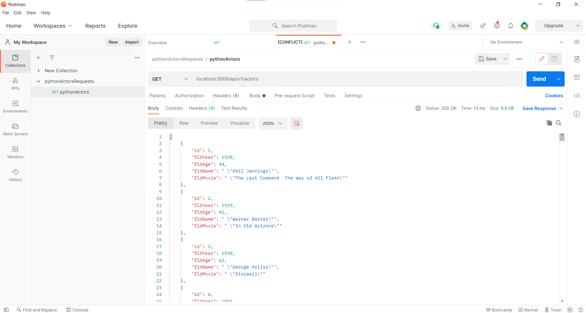
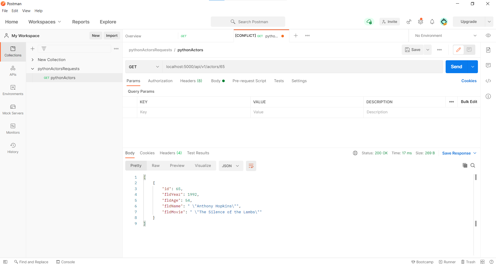
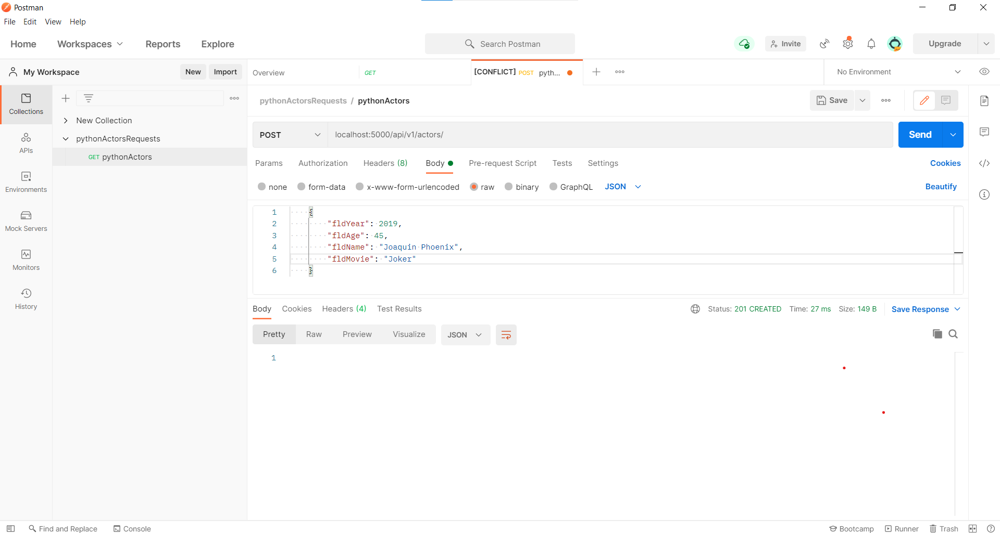
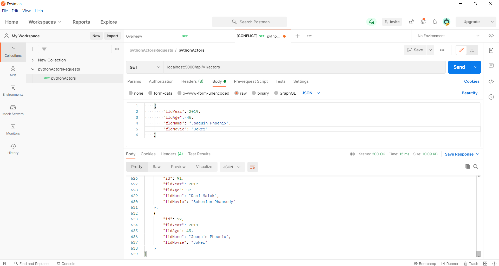
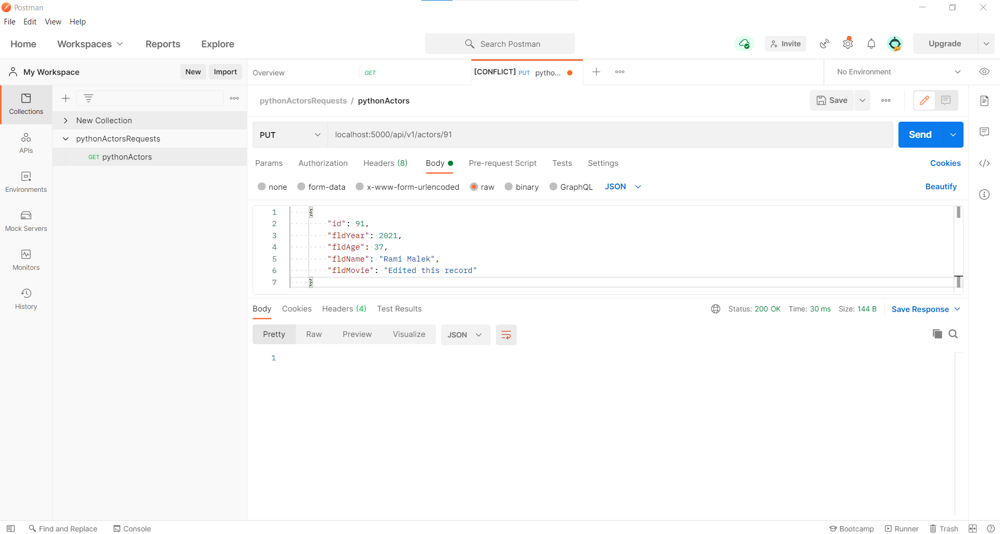
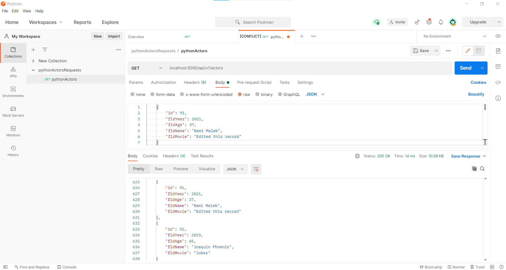
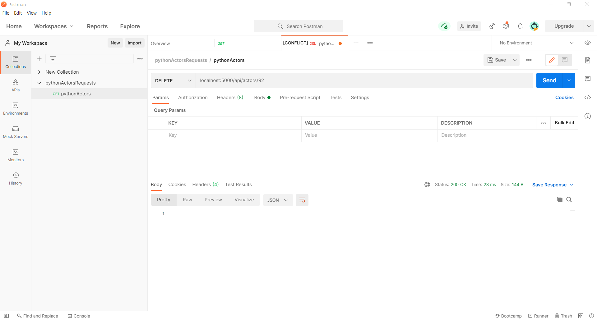
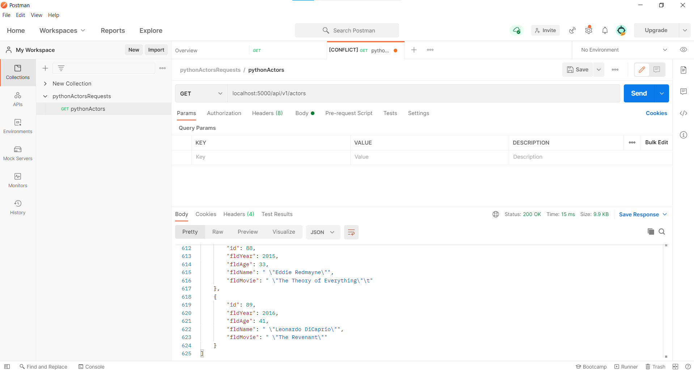

# Web Application Part 3
This project is a homework assignment how to get REST API setup with Docker, Flask, MySQL and Postman.
# Postman listing all records

# Postman showing one record with a get request

# Postman showing creating a record by showing the post request and the results in the record listing 

# Postman showing edit a record by showing the put request and the results in the record listing  

# Postman showing delete a record by showing the delete request and the results in the record listing

