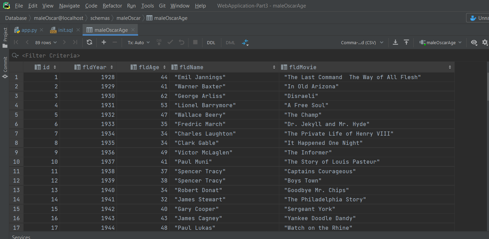
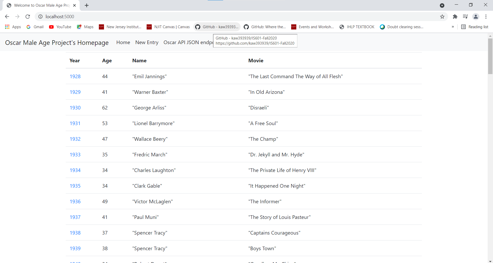
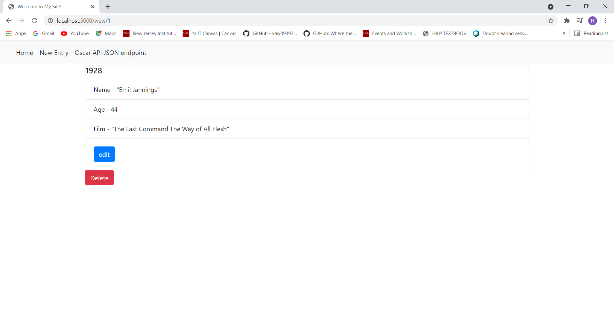
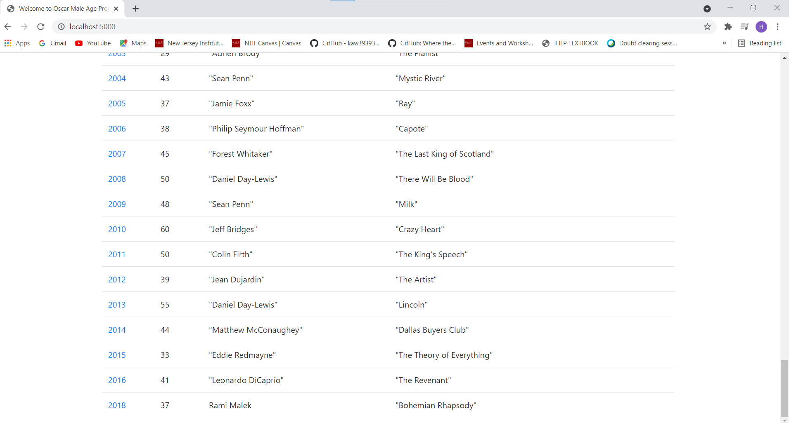
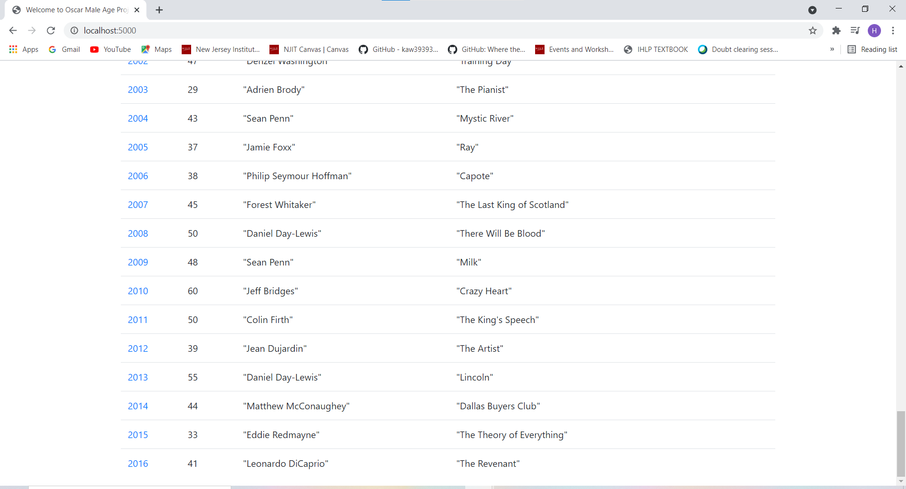

# Web Application Part 3
This project is a homework assignment to learn how to get Pycharm setup with Docker, Flask, MySQL and Postman.
# SQL Data in Pycharm

# Localhost Home page

# View of single record 

# New record added at the last 

# Updated last record

# Deleted last record
