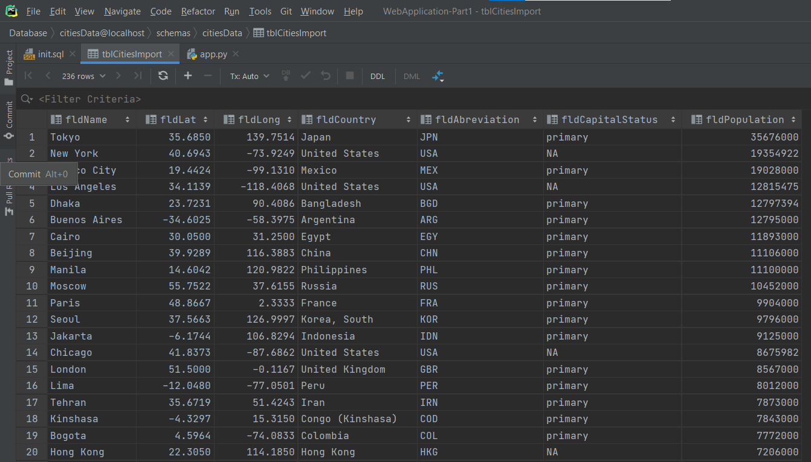
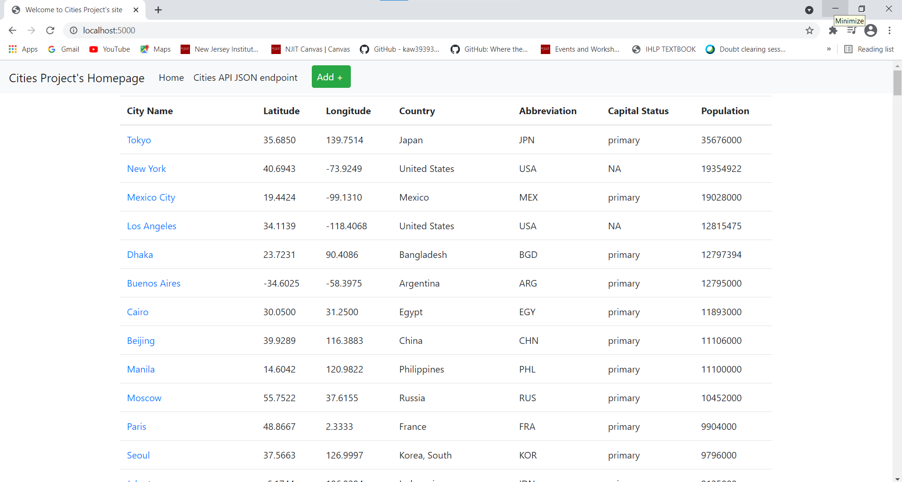
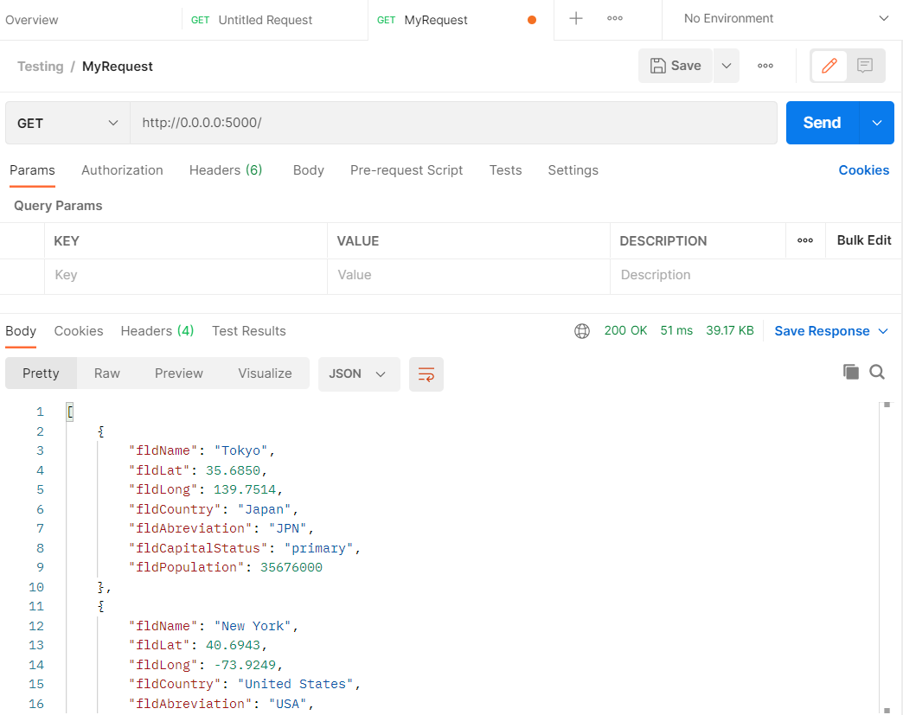

# Web Application Part 3
This project is a homework assignment to learn how to get Pycharm setup with Docker, Flask, MySQL and Postman.
# SQL Data Screenshot

# Localhost Screenshot

# Postman Screenshot
